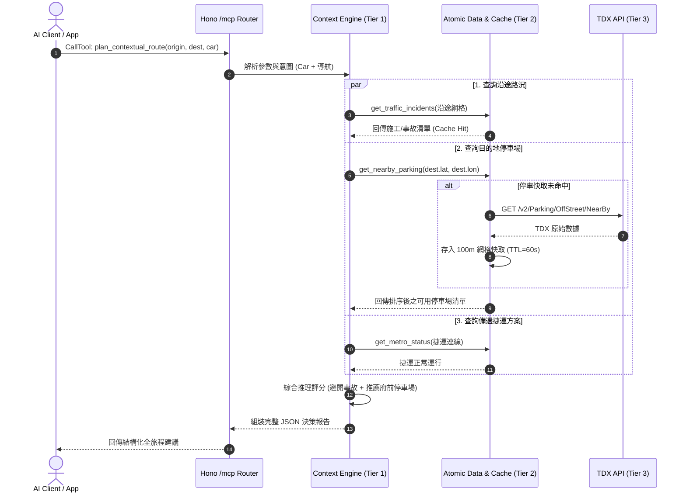
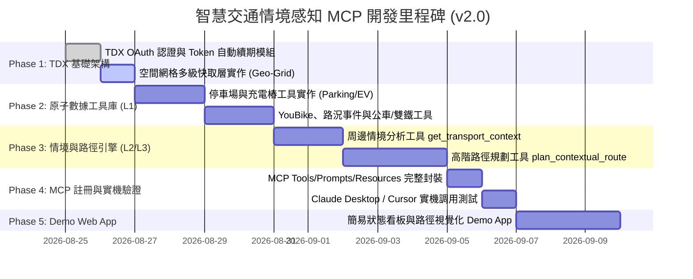

# 智慧交通情境感知 MCP 伺服器 (Context-Aware Transportation MCP)
## 系統架構、階層式管線、情境路徑規劃與落地實作規劃書 (v2.0)

> **專案代號**：`cf-transport-context-mcp`  
> **運行環境**：Cloudflare Workers (Edge Serverless) + Hono + @modelcontextprotocol/sdk  
> **核心數據來源**：交通部 TDX (Transport Data eXchange) 開放平台  
> **規劃版本**：v2.0（加入階層式自動拆解管線、多級快取機制、高階情境路徑規劃）  
> **日期**：2026-08-25  

---

## 📑 目錄

1. [核心架構概念：階層式資訊拆解與快取管線 (Hierarchical Decomposition & Cache Pipeline)](#1-核心架構概念階層式資訊拆解與快取管線)
2. [高階情境路徑規劃設計 (Context-Aware Route & Journey Planning)](#2-高階情境路徑規劃設計)
3. [多維度情境推理引擎模型 (Context Inference Engine)](#3-多維度情境推理引擎模型)
4. [MCP 工具體系與介面規格 (MCP Tools Specification)](#4-mcp-工具體系與介面規格)
   * 4.1 [High-Level 情境感知與路徑決策工具 (L2/L3)](#41-high-level-情境感知與路徑決策工具)
   * 4.2 [Low-Level 基礎原子數據工具 (L1)](#42-low-level-基礎原子數據工具)
5. [資料合約與結構化輸出規範 (JSON Schema & Contracts)](#5-資料合約與結構化輸出規範)
6. [Cloudflare Worker 邊緣快取與 TDX 頻控設計](#6-cloudflare-worker-邊緣快取與-tdx-頻控設計)
7. [系統呼叫時序圖 (System Sequence Diagrams)](#7-系統呼叫時序圖)
8. [未來展示層：Demo App 與 AI 小秘書銜接方案](#8-未來展示層demo-app-與-ai-小秘書銜接方案)
9. [分階段實施路線圖與下一步工作 (Implementation Roadmap)](#9-分階段實施路線圖與下一步工作)

---

## 1. 核心架構概念：階層式資訊拆解與快取管線

為了解決傳統交通 MCP「AI 需連續呼叫多次 API、延遲高、Token 消耗大、缺少即時決策」的痛點，本系統採用 **三層階層式架構 (3-Tier Hierarchical Architecture)**：

```
┌──────────────────────────────────────────────────────────────────────────────────┐
│                             AI Host Client / Agent                               │
│              (Claude Desktop / Cursor / Web App / AI 交通小秘書)                 │
└────────────────────────────────────────┬─────────────────────────────────────────┘
                                         │ 
                        [呼叫 High-Level 工具]
                        - get_transport_context()
                        - plan_contextual_route()
                                         ▼
┌──────────────────────────────────────────────────────────────────────────────────┐
│  Tier 1: High-Level Context & Journey Engine (情境推理與決策層)                  │
│                                                                                  │
│  1. 接收意圖：身分 (Car/EV/Bike...) + 狀態 (Urgent/Cruising...) + 起訖點/位置   │
│  2. 自動意圖拆解 (Auto Task Decomposition)：分析需要哪些原子數據 (Parking, YouBike...)│
│  3. 並行調度 (Parallel Dispatcher)：同時向 Tier 2 請求多項資料                   │
│  4. 評分與語意合成 (Rule Scorer & LLM Synthesizer)：輸出最優建議與風險預警        │
└────────────────────────────────────────┬─────────────────────────────────────────┘
                                         │ 並行調用 Low-Level 資料模組 (Promise.all)
                                         ▼
┌──────────────────────────────────────────────────────────────────────────────────┐
│  Tier 2: Low-Level Atomic Data Layer & Cache Router (原子數據與快取路由層)       │
│                                                                                  │
│   ┌──────────────────────────────────────────────────────────────────────────┐   │
│   │                      多級邊緣快取 (Multi-Tier Cache)                     │   │
│   │   - L1: In-Memory Hot Cache (100m 空間網格 / 15s~60s TTL)                │   │
│   │   - L2: Cloudflare Workers KV / Cache API (城市級靜態資料 / 24h TTL)     │   │
│   │   - L3: Upstash / Redis (跨實例長效會話快取)                             │   │
│   └────────────────────────────────────┬─────────────────────────────────────┘   │
│                                        │                                         │
│                ┌───────────────────────┴───────────────────────┐                 │
│         [Cache HIT: < 1ms]                              [Cache MISS]             │
│                │                                               │                 │
│                ▼ (立即回傳)                                    ▼                 │
│         直接提供 Tier 1 使用                     透過 TDX Client 向外請求        │
└────────────────────────────────────────────────────────────────┼─────────────────┘
                                                                 │
                                                                 ▼
┌──────────────────────────────────────────────────────────────────────────────────┐
│  Tier 3: TDX Connector & Rate Limit Circuit Breaker (TDX 介接與斷路器)           │
│  - 自動 OAuth 2.0 Token 續期 (23 小時快取)                                       │
│  - OData 空間與文字過濾器 ($spatial_filter, $filter)                             │
│  - 頻率限制保護 (429 自動退避與降級備案)                                         │
└──────────────────────────────────────────────────────────────────────────────────┘
```

### 💡 核心運作原則：
1. **高層工具主動拆解**：高層工具（如路徑規劃）不直接寫死硬編碼，而是將情境需求轉化為對應的低層資料清單。
2. **快取優先 (Cache-First)**：每一個低層資料需求在發起網路請求前，必先檢查邊緣快取；**命中率預期可達 70%~90%**，大幅降低 TDX Quota 消耗與網路延遲。
3. **無縫降級 (Graceful Degradation)**：若某項 TDX 子 API 暫時故障（如 YouBike 即時 API 逾時），情境引擎自動標記該項為「預估值/歷史統計」，不中斷整個高層情境產出。

---

## 2. 高階情境路徑規劃設計 (Context-Aware Route & Journey Planning)

傳統地圖路徑規劃（如 Google Maps）僅計算「距離與時間最短」，無法感知即時運具痛點（如：到了才發現沒車位、下雨天騎車打滑、大眾運輸誤點）。

本專案新增的高階工具 **`plan_contextual_route`** 提供 **「全旅程情境決策 (End-to-End Contextual Journey Strategy)」**：

```
                起點 (Origin) ───────────────────────────> 終點 (Destination)
                     │                                            │
                     ▼                                            ▼
               [出發前情境]                                 [抵達後最後一哩]
        - 起點周邊 YouBike 可借車數                   - 終點周邊停車場剩餘位 (即時)
        - 天候狀態 (是否暴雨/高溫)                    - 終點周邊 YouBike 可還格位
        - 即時班次到站預估                           - 終點充電站 (快充/慢充空閒槍數)
                     │                                            │
                     └────────────────────┬───────────────────────┘
                                          │
                                          ▼
                                   [沿途動態監控]
                           - 施工管制、交通事故、回堵路段
                           - 替代動線推薦 / 轉乘運具切換建議
```

### 2.1 各身分路徑規劃決策特徵

| 身分 (Identity) | 自動拆解的 Low-Level 查詢 | 情境決策重點 | 輸出策略範例 |
| :--- | :--- | :--- | :--- |
| **汽車 (`car`)** | 1. 沿途事故施工 (`incidents`)<br>2. 終點停車場空位 (`parking`) | 終點車位剩餘率、沿途嚴重回堵避讓 | 「推薦路線走市民高架，**避開建國南路事故**；終點請直接導航至**府前地下停車場（剩 110 位）**，步行至目的地 3 分鐘。」 |
| **電動車 (`ev`)** | 1. 沿途施工 (`incidents`)<br>2. 終點快充站可用槍數 (`ev_chargers`) | 快充槍規格 (CCS1/CCS2) 與即時空閒狀況 | 「導航至目標商圈，推薦停靠**信義 A 站 DC 快充（目前 2 槍空閒）**，充電 20 分鐘即可補滿。」 |
| **機車 (`scooter`)** | 1. 沿途即時雨況與積水<br>2. 施工與封閉路段 (`incidents`) | 禁行機車路段、雨天改道、橋樑機車道壅塞 | 「台北橋機車道目前施工回堵，且降雨機率 90%，建議**改走忠孝橋**或**暫時轉乘中和新蘆線捷運**。」 |
| **單車 (`bike`)** | 1. 起點 YouBike 可借數 (`youbike`)<br>2. 終點 YouBike 可還數 (`youbike`) | 起點無車可借、終點無位可還（滿站）風險 | 「起點捷運站僅剩 2 台車（**即將枯竭**），建議快走借車；終點站目前**車位充足（剩 18 格可還）**。」 |
| **大眾運輸 (`transit`)** | 1. 雙鐵/捷運即時狀態 (`rail_board`/`metro`)<br>2. 接駁公車預估到站 (`bus_arrival`) | 轉乘銜接時間、列車延誤補償、末班車防呆 | 「搭乘高鐵 1320 車次（**準點**），抵達台北車站後於 3 分鐘內可銜接**板南線往南港**，最後轉乘 204 公車（3分後到站）。」 |

---

## 3. 多維度情境推理引擎模型 (Context Inference Engine)

情境推理引擎核心將輸入參數映射為結構化決策矩陣：

$$\text{Context Matrix} = \text{Identity} \times \text{State} \times \text{Geo-Spatial} \times \text{Environmental Constraints}$$

```
                ┌─────────────────────────────────────────────────────────┐
                │                     輸入情境參數                        │
                │  - Identity: car | ev | scooter | bike | transit...    │
                │  - State: cruising | urgent | commute_in | commute_out  │
                │  - Geo: lat, lon, radius, (optional destination)        │
                │  - Time: weekday/weekend, peak/off-peak, weather       │
                └────────────────────────────┬────────────────────────────┘
                                             │
                                             ▼
                ┌─────────────────────────────────────────────────────────┐
                │             自動任務拆解器 (Task Planner)              │
                │  根據 (Identity, State) 決定需發起哪些 Low-Level 查詢    │
                └──────┬─────────────────────┬─────────────────────┬──────┘
                       │                     │                     │
                       ▼                     ▼                     ▼
               [Query: Parking]      [Query: Incidents]     [Query: YouBike]
                       │                     │                     │
                       ▼                     ▼                     ▼
               ┌───────────────────────────────────────────────────┐
               │           快取路由與 TDX 邊緣擷取管線             │
               └───────────────────────┬───────────────────────────┘
                                       │
                                       ▼
                ┌─────────────────────────────────────────────────────────┐
                │              情境評分與決策合成 (Evaluator)              │
                │  - 車位枯竭率評估 (Exhaustion Risk Score)               │
                │  - 延誤衝擊加權 (Delay Severity Weight)                 │
                │  - 多方案優先順序排序 (Ranked Alternatives)             │
                └────────────────────────────┬────────────────────────────┘
                                             │
                                             ▼
                ┌─────────────────────────────────────────────────────────┐
                │            結構化情境報告 (Actionable Output)           │
                │  { situation, recommendations, risks, quick_metrics }   │
                └─────────────────────────────────────────────────────────┘
```

---

## 4. MCP 工具體系與介面規格

### 4.1 High-Level 情境感知與路徑決策工具

#### 🛠️ Tool 1: `get_transport_context` (即時周邊情境洞察)
* **功能**：根據使用者身分、當前狀態與所在位置，自動判斷周邊交通態勢並給出主動決策建議。
* **Input Schema**:
```json
{
  "type": "object",
  "properties": {
    "identity": {
      "type": "string",
      "enum": ["car", "ev", "scooter", "bike", "transit", "pedestrian"],
      "description": "使用者交通身分"
    },
    "state": {
      "type": "string",
      "enum": ["cruising", "urgent", "commute_in", "commute_out", "transit_transfer", "rain_fallback"],
      "description": "使用者目前狀態或意圖"
    },
    "latitude": { "type": "number", "description": "目前緯度 (WGS84)" },
    "longitude": { "type": "number", "description": "目前經度 (WGS84)" },
    "location_name": { "type": "string", "description": "地標或行政區備註（選填，如'台北101'）" },
    "radius_meters": { "type": "number", "default": 800, "description": "搜尋半徑公尺數" }
  },
  "required": ["identity", "state", "latitude", "longitude"]
}
```

#### 🛠️ Tool 2: `plan_contextual_route` (情境路徑與全旅程決策規劃 - **NEW**)
* **功能**：結合即時 TDX 狀態（停車位/事故/施工/雙鐵誤點/YouBike借還預警），生成具備情境感知的導航與旅程決策策略。
* **Input Schema**:
```json
{
  "type": "object",
  "properties": {
    "origin": {
      "type": "object",
      "properties": {
        "latitude": { "type": "number" },
        "longitude": { "type": "number" },
        "name": { "type": "string" }
      },
      "required": ["latitude", "longitude"],
      "description": "出發地座標與名稱"
    },
    "destination": {
      "type": "object",
      "properties": {
        "latitude": { "type": "number" },
        "longitude": { "type": "number" },
        "name": { "type": "string" }
      },
      "required": ["latitude", "longitude"],
      "description": "目的地座標與名稱"
    },
    "identity": {
      "type": "string",
      "enum": ["car", "ev", "scooter", "bike", "transit", "multimodal"],
      "description": "預計使用的交通工具或多運具混合"
    },
    "urgency": {
      "type": "string",
      "enum": ["normal", "high", "relaxed"],
      "default": "normal",
      "description": "時間急迫度：normal (一般)、high (極趕時間、避開所有不確定性)、relaxed (休閒愜意)"
    },
    "preferences": {
      "type": "object",
      "properties": {
        "prefer_indoor_parking": { "type": "boolean", "description": "汽車：優先推薦室內/地下停車場" },
        "need_ev_charge": { "type": "boolean", "description": "電動車：目的地或沿途需要補電" },
        "avoid_tolls": { "type": "boolean", "description": "避開收費路段" }
      }
    }
  },
  "required": ["origin", "destination", "identity"]
}
```

---

### 4.2 Low-Level 基礎原子數據工具

底層工具專注於提供單一領域即時資料，具備獨立快取機制，既可單獨供 AI 呼叫，也是 High-Level 工具自動拆解的調用基礎：

| 工具名稱 | 核心參數 | 數據來源 / TDX 領域 | 快取 TTL | 說明 |
| :--- | :--- | :--- | :--- | :--- |
| `get_nearby_parking` | `lat, lon, radius, ev_only` | 停車場即時剩餘位 API | 60s | 取得附近停車場空位率、費率與距離 |
| `get_nearby_ev_chargers` | `lat, lon, plug_type` | 電動車充電站動態 API | 60s | 取得快充/慢充可用槍數與規格 |
| `get_nearby_youbike` | `lat, lon, radius` | YouBike 2.0 即時動態 | 30s | 站點可借車輛數、可還車位數、無車預警 |
| `get_traffic_incidents` | `city, lat, lon, radius` | 道路即時路況/施工/事故 | 180s | 沿途與周邊交通阻礙、施工與壅塞通報 |
| `get_bus_estimated_arrival` | `city, route_name, stop_name` | 公車 N1 預估到站動態 | 15s | 指定路線/站牌即時預估到站時間 |
| `get_rail_live_board` | `station_id, rail_type` | 台鐵/高鐵即時看板 | 30s | 車站即時到離月台看板與延誤狀態 |

---

## 5. 資料合約與結構化輸出規範

### 5.1 `plan_contextual_route` 回傳格式範例

```json
{
  "journey_summary": {
    "origin_name": "捷運公館站",
    "destination_name": "台北101世貿大樓",
    "selected_mode": "car",
    "estimated_travel_time_min": 22,
    "recommended_departure": "即刻出發",
    "overall_traffic_condition": "moderate_congestion"
  },
  "recommended_strategy": {
    "title": "建議走基隆路高架 ➔ 府前地下停車場",
    "route_description": "由公館上基隆路高架，於信義路匝道下平面。避開基隆路地下道南向施工回堵。",
    "destination_parking_plan": {
      "parking_name": "台北市政府府前廣場地下停車場",
      "available_spaces": 138,
      "distance_to_dest_meters": 450,
      "walking_time_min": 6,
      "rate_per_hour": 40,
      "status": "plenty_of_spaces"
    }
  },
  "enroute_alerts": [
    {
      "type": "incident",
      "severity": "medium",
      "location": "基隆路地下道南向",
      "description": "外側車道施工封閉，回堵延誤約 8-12 分鐘",
      "action_taken": "已在推薦路線中為您自動繞開"
    }
  ],
  "alternative_options": [
    {
      "mode": "transit",
      "title": "改搭大眾捷運（最準點方案）",
      "travel_time_min": 18,
      "steps": "搭乘松山新店線至中正紀念堂 ➔ 轉淡水信義線直達台北101/世貿站（4號出口直通）",
      "advantage": "免找車位、不受施工路況影響"
    }
  ]
}
```

---

## 6. Cloudflare Worker 邊緣快取與 TDX 頻控設計

### 6.1 空間網格雜湊算法 (Geo-Grid Hashing)

為了防止不同使用者在相鄰座標（例如相差 50 公尺）重複觸發 TDX API，系統使用 **空間網格化取整 (Spatial Grid Rounding)**：

```typescript
export function buildGeoGridKey(category: string, lat: number, lon: number, precision = 3): string {
  // precision = 3 代表經緯度取到小數第 3 位 (精確度約 110m x 90m 網格)
  const gridLat = lat.toFixed(precision);
  const gridLon = lon.toFixed(precision);
  return `tdx:geo:${category}:${gridLat}:${gridLon}`;
}
```

### 6.2 多級快取流轉邏輯

```
[Low-Level 工具發起查詢: get_nearby_parking(25.0339, 121.5644)]
                      │
                      ▼
       [計算網格 Key: tdx:geo:parking:25.034:121.564]
                      │
           ┌──────────┴──────────┐
      [Cache HIT]           [Cache MISS]
           │                     │
           ▼ (< 1ms)             ▼
     回傳快取數據         1. 取得 TDX OAuth Token (從 KV/Memory 快取)
                          2. 向 TDX 發送 OData 請求 ($spatial_filter)
                          3. 寫入快取 (TTL = 60 秒)
                          4. 回傳解析後的標準化資料
```

---

## 7. 系統呼叫時序圖 (System Sequence Diagrams)

### 7.1 高階情境路徑規劃呼叫時序



---

## 8. 未來展示層：Demo App 與 AI 小秘書銜接方案

本 MCP 具備極強的擴充彈性，未來在展示與應用層可快速落地：

```
                               ┌────────────────────────────────┐
                               │     Transportation MCP         │
                               │  (Cloudflare Worker @ /mcp)    │
                               └───────────────┬────────────────┘
                                               │
                   ┌───────────────────────────┴───────────────────────────┐
                   │                                                       │
                   ▼                                                       ▼
   ┌───────────────────────────────┐                       ┌───────────────────────────────┐
   │       MVP Demo Web App        │                       │        AI 交通小秘書          │
   │  - 左上：身分切換             │                       │  - 定時主動關心 (Cron Push)  │
   │  - 右上：狀態/意圖切換        │                       │  - 突發事故即時警報          │
   │  - 中間：即時情報瀑布流       │                       │  - Line / Telegram / WebPush  │
   │  - 底部：情境路線一鍵規劃     │                       │  - 語音對話助手              │
   └───────────────────────────────┘                       └───────────────────────────────┘
```

---

## 9. 分階段實施路線圖與下一步工作



### 🚀 即將開工的具體步驟：
1. **設定環境變數**：於 `wrangler.jsonc` 與 `.env` 配置 `TDX_CLIENT_ID` 與 `TDX_CLIENT_SECRET`。
2. **建立 TDX 服務模組 (`src/services/tdx/`)**：
   * `auth.ts`（OAuth 2.0 自動管理）
   * `client.ts`（空間過濾與 OData 請求）
   * `geo.ts`（經緯度距離計算與 100m 空間網格 Key 產生器）
3. **實作 Low-Level 原子工具並串接快取**。
4. **實作 High-Level Context & Route Planning 推理層**。
5. **在 `src/mcp/server.ts` 註冊所有工具** 並以測試腳本驗證。

---
*本規劃書已更新完畢，隨時可依據使用者確認啟動第一階段編程。*
