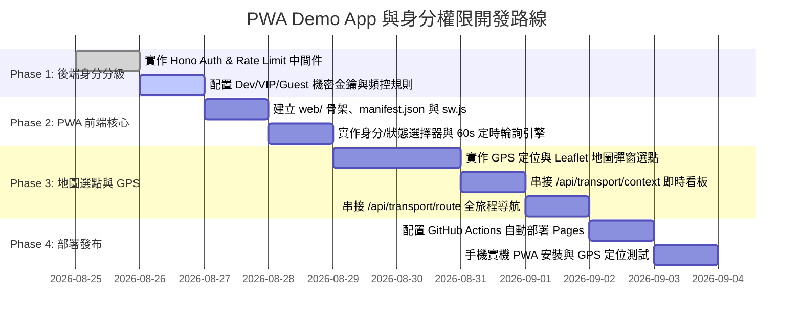

# 智慧交通 MCP 身分權限分級 (Auth & Rate Limit)
## 與 GitHub Pages PWA Demo App 完整規劃書

> **專案代號**：`cf-transport-context-pwa`  
> **後端服務**：Cloudflare Workers (Hono + MCP Server)  
> **前端部署**：GitHub Pages (支援 PWA, GPS 定位, 互動地圖選點, 1分鐘定時輪詢)  
> **規劃作者**：Antigravity Agent  
> **日期**：2026-08-25  

---

## 📑 目錄

1. [Cloudflare MCP 身分分級與頻控設計 (Auth & Rate Limiting)](#1-cloudflare-mcp-身分分級與頻控設計)
2. [PWA Demo App 技術架構與優勢 (PWA Tech Stack)](#2-pwa-demo-app-技術架構與優勢)
3. [前端 UI/UX 互動與功能模組設計 (UI/UX & Feature Specs)](#3-前端-uiux-互動與功能模組設計)
   * 3.1 [頂部身分與計時器 (Top Bar & Auto-Refresh)](#31-頂部身分與計時器)
   * 3.2 [身分與狀態選擇矩陣 (Identity & State Selectors)](#32-身分與狀態選擇矩陣)
   * 3.3 [位置選取：GPS 一鍵定位 + 互動地圖選點 (Location Picker)](#33-位置選取gps-一鍵定位--互動地圖選點)
   * 3.4 [即時情報瀑布流與全旅程導航 (Context & Route View)](#34-即時情報瀑布流與全旅程導航)
4. [前後端通訊協議與資料流 (API & Communication Flow)](#4-前後端通訊協議與資料流)
5. [前端專案目錄與 GitHub Pages 部署流程 (Project Layout & Deployment)](#5-前端專案目錄與-github-pages-部署流程)
6. [分階段開發路線圖 (Implementation Milestones)](#6-分階段開發路線圖)

---

## 1. Cloudflare MCP 身分分級與頻控設計

為了避免公開的 Cloudflare Worker 被惡意刷量耗盡 TDX 配額，同時滿足開發測試與不同使用者的體驗，我們在 Cloudflare Worker 加入 **三級身分識別 (Tiered Role-based Access Control & Rate Limiting)**。

### 1.1 三種身分權限矩陣

```
                     ┌─────────────────────────────────────────────────┐
                     │            Incoming Request (API / MCP)         │
                     │  - Header: Authorization: Bearer <key>          │
                     │  - Query : ?token=<key>                         │
                     └────────────────────────┬────────────────────────┘
                                              │
                                              ▼
                     ┌─────────────────────────────────────────────────┐
                     │     Hono Auth & Rate Limit Middleware           │
                     └────────────────────────┬────────────────────────┘
                                              │
                      ┌───────────────────────┼───────────────────────┐
                      ▼                       ▼                       ▼
           ┌─────────────────────┐ ┌─────────────────────┐ ┌─────────────────────┐
           │      1. Dev 開發者   │ │     2. VIP 用戶     │ │    3. Guest 訪客    │
           │  (Developer Mode)   │ │   (Priority User)   │ │    (Public Tier)    │
           ├─────────────────────┤ ├─────────────────────┤ ├─────────────────────┤
           │ • 0 頻率限制 (無上限)│ │ • 高頻刷新 (15s~30s) │ │ • 基礎頻控 (60s/次)  │
           │ • 支援 Debug 追蹤   │ │ • 每日 1,000 次調用 │ │ • 每日 60 次調用    │
           │ • 支援強制穿透快取  │ │ • 優先快取與路徑規劃│ │ • 限制僅周邊情境查詢│
           │ • 存取所有管理端點  │ │ • 無廣告、即時推播  │ │ • 預設全域空間快取  │
           └─────────────────────┘ └─────────────────────┘ └─────────────────────┘
```

| 身分 (Role) | 識別方式 (Credential) | 輪詢頻率上限 (Rate Limit) | 每日配額 (Quota) | 支援功能清單 |
| :--- | :--- | :--- | :--- | :--- |
| **`dev` (開發者)** | `DEV_SECRET_KEY` | **不限制 (Unlimited)** | 無上限 | 完整情境、路徑規劃、所有原子工具、快取管理端點、Debug 延遲追蹤 |
| **`vip` (VIP 用戶)** | `VIP_API_KEY_xxx` | **最快每 15 秒 1 次** (4 QPM) | 1,000 次/天 | 完整情境、全旅程路徑規劃、高鐵/台鐵/捷運看板、快充與停車場預警 |
| **`guest` (訪客/體驗)** | 無金鑰 (預設 Anonymous) | **每 60 秒 1 次** (1 QPM) | 60 次/天 (依 IP) | 基礎交通情境感知（停車位、YouBike、路況概況），不可高頻輪詢 |

### 1.2 中間件 (Middleware) 實作設計

```typescript
// 概念實作於 src/middlewares/auth.ts
export async function authAndRateLimitMiddleware(c: Context, next: Next) {
  const token = c.req.header("Authorization")?.replace("Bearer ", "") 
                || c.req.query("token") 
                || c.req.header("X-API-Key");

  let role: "dev" | "vip" | "guest" = "guest";
  if (token === c.env.DEV_SECRET_KEY) {
    role = "dev";
  } else if (token && token.startsWith("vip_")) {
    role = "vip";
  }

  // 訪客依 IP 進行滑動窗口限流 (Sliding Window Rate Limit)
  const clientIP = c.req.header("CF-Connecting-IP") || "anonymous";
  if (role === "guest") {
    const isAllowed = await checkRateLimit(clientIP, 60 /* 60s 內限 1 次 */);
    if (!isAllowed) {
      return c.json({
        error: "Rate limit exceeded for Guest tier. Please wait 60 seconds or upgrade to VIP/Dev.",
        retryAfterSeconds: 60,
        role: "guest"
      }, 429);
    }
  }

  c.set("userRole", role);
  await next();
}
```

---

## 2. PWA Demo App 技術架構與優勢

### 2.1 為什麼選擇 PWA (Progressive Web App)？

1. **零安裝成本，直接透過網址開啟**：部署在 GitHub Pages（例如 `https://<user>.github.io/cf-mcp-playground/`），任何手機或瀏覽器打開即用。
2. **支援「新增至主畫面 (Add to Home Screen)」**：使用者在 Safari (iOS) 或 Chrome (Android) 點擊分享即可加入手機桌面，擁有如同原生 App 的全螢幕體驗（獨立視窗、無網址列、客製化 App Icon 與啟動畫面）。
3. **原生支援 GPS 定位 (`navigator.geolocation`)**：一鍵獲取高精度經緯度與精確度半徑。
4. **離線快取 (Service Worker)**：靜態資產秒級載入，網路短暫中斷時可顯示最近一次交通快照。

### 2.2 前端技術選型
* **Core**：HTML5 + Vanilla TypeScript / ES Modules（極速無負擔，零冗餘依賴）。
* **Styling (CSS)**：精緻現代化 Glassmorphism 深色主題 + 微動畫 (Micro-animations)，支援 Mobile Responsive。
* **Map Component**：**Leaflet.js + OpenStreetMap**（輕量開源地圖，無須申請 Google Maps API Key，支援點擊地圖標記座標、拖曳移動位置）。
* **PWA Assets**：`manifest.json`、`sw.js`（Service Worker）、向量 App Icon。

---

## 3. 前端 UI/UX 互動與功能模組設計

```
+-------------------------------------------------------------+
| 🚦 Transport Context AI                    [ 身分: DEV ▾ ]   |
| ⏱️ 下次刷新: 48s [ 🔄 立即更新 ]           [ ⚙️ API Key ]   |
+-------------------------------------------------------------+
| 📍 目前位置: 台北市信義區松智路 (25.0339, 121.5644)          |
|    [ 🎯 我的 GPS 位置 ]   [ 🗺️ 地圖選點 ]   [ 常用地標 ▾ ]  |
+-------------------------------------------------------------+
| 【交通身分】                                                |
| [ 🚗 汽車 ] [ ⚡ 電動車 ] [ 🛵 機車 ] [ 🚲 單車 ] [ 🚇 捷運 ] |
|                                                             |
| 【當前狀態 / 意圖】                                         |
| [ ☕ 漫遊巡航 ] [ 🚨 趕時間 ] [ 💼 通勤上班 ] [ 🏠 下班返家 ]  |
+-------------------------------------------------------------+
| 🧭 Tab: 【 即時情報看板 】  |  【 情境全旅程導航 】          |
+-------------------------------------------------------------+
|                                                             |
|  🟡 【情境評估】商圈週末夜間車多，周邊停車場接近滿位          |
|                                                             |
|  🎯 【行動建議】                                            |
|  1. 優先前往【府前廣場地下場】(尚有 142 格 / 距此 400m)      |
|  2. 避開市府路，走松仁路側進場                              |
|                                                             |
|  ⚠️ 【突發事件與風險】                                      |
|  • 基隆路地下道南向單線施工管制 (預計延誤 10 分鐘)           |
|                                                             |
|  ⚡ 【即時指標數據】                                        |
|  ┌──────────────┬──────────────┬──────────────┐             |
|  │ 可用停車位   │ 附近 YouBike │ 快充空閒槍   │             |
|  │   172 格     │   28 台      │   2 槍       │             |
|  └──────────────┴──────────────┴──────────────┘             |
|                                                             |
+-------------------------------------------------------------+
| 💬 AI 交通小秘書:「為您持續監控中，30秒後自動更新路況...」  |
+-------------------------------------------------------------+
```

### 3.1 頂部身分與計時器 (Top Bar)
* **身分切換選單**：切換 `Dev` / `VIP` / `Guest`，點選齒輪可輸入/儲存 API Key（儲存在瀏覽器 `localStorage`）。
* **圓環倒數計時器**：顯示距離下次自動更新的秒數（預設 60 秒）。支援點擊「🔄 立即更新」按鈕發起即時請求。

### 3.2 身分與狀態選擇矩陣 (Identity & State Selectors)
* **身分橫向滾動膠囊**：
  * 🚗 汽車 (`car`)
  * ⚡ 電動車 (`ev`)
  * 🛵 機車 (`scooter`)
  * 🚲 YouBike/單車 (`bike`)
  * 🚇 捷運/公車通勤 (`transit`)
  * 🚶 步行/無障礙 (`pedestrian`)
* **狀態/意圖膠囊**：
  * ☕ 無目的地漫遊 (`cruising`)
  * 🚨 趕時間模式 (`urgent`)
  * 💼 通勤上班 (`commute_in`)
  * 🏠 下班返家 (`commute_out`)
  * 🚅 出差雙鐵轉乘 (`transit_transfer`)
  * 🌧️ 雨天避難模式 (`rain_fallback`)

### 3.3 位置選取：GPS 一鍵定位 + 互動地圖選點
1. **「🎯 我的 GPS 位置」按鈕**：
   * 呼叫手機 HTML5 `navigator.geolocation.getCurrentPosition`。
   * 自動取得使用者即時座標並自動反查周邊路況。
2. **「🗺️ 地圖選點」按鈕**：
   * 彈出 Leaflet 全螢幕地圖 Modal。
   * 使用者可在地圖上隨意點擊或拖曳大頭針（Pin）。
   * 支援搜尋地址或關鍵字（如「台北101」、「板橋車站」），點選「確認選擇」立即更新主畫面座標。
3. **快捷預設據點**：
   * 預設提供台灣熱門商圈（信義商圈、台北車站、西門町、台中逢甲、新竹巨城、高雄巨蛋等）一鍵切換。

### 3.4 即時情報瀑布流與情境導航模式
* **模式 A：即時情報看板 (Live Context Feed)**：
  * 狀態警告橫幅（綠色正常 / 黃色警戒 / 紅色危急）。
  * 結構化建議卡片（標記 Priority 1、Priority 2）。
  * 事故與施工警報。
  * 儀表板數據卡（停車位剩餘、YouBike 可借還、快充槍數、平均車速）。
* **模式 B：情境全旅程導航 (Context Route Navigation)**：
  * 設定起點與目的地。
  * 呼叫 `/api/transport/route`。
  * 顯示最佳路徑、沿途施工避讓提示、目的地最佳停車場（附空位數與步行時間）以及捷運避堵備選方案。

---

## 4. 前後端通訊協議與資料流

```
┌─────────────────────────────────────────────────────────────┐
│                 GitHub Pages PWA Demo App                   │
│   (https://<user>.github.io/cf-mcp-playground/)             │
└──────────────┬──────────────────────────────▲───────────────┘
               │ 1. 每 60 秒定時輪詢 (或手動點擊)│
               │    POST /api/transport/context                │
               │    Headers: Authorization: Bearer <key>      │
               │    Body: { identity, state, lat, lon }        │
               │                                               │ 2. 回傳 JSON 決策報告
               ▼                                               │
┌─────────────────────────────────────────────────────────────┴┐
│         Cloudflare Worker MCP Server (Edge Service)          │
│   (https://cf-mcp-playground.<subdomain>.workers.dev)        │
│                                                              │
│  - Hono Auth Middleware 檢查身分與頻控                       │
│  - Context Evaluator 並行調度低階資料                        │
│  - 100m 空間網格快取 (<1ms) ➔ TDX API (MISS 時)              │
└──────────────────────────────────────────────────────────────┘
```

---

## 5. 前端專案目錄與 GitHub Pages 部署流程

我們將在現有專案中新增 `web/` 目錄，專門存放 PWA Demo 網頁原始碼：

```
cf-mcp-playground/
├── src/                     # Cloudflare Worker 後端與 MCP 邏輯
├── web/                     # 🌐 GitHub Pages PWA 前端原始碼
│   ├── index.html           # 主網頁結構
│   ├── manifest.json        # PWA 應用設定檔 (Name, Icons, Theme Color)
│   ├── sw.js                # Service Worker 離線與資源快取
│   ├── styles/
│   │   ├── main.css         # 現代深色玻璃擬態樣式
│   │   └── leaflet.css      # 地圖元件樣式
│   ├── scripts/
│   │   ├── app.js           # 主應用邏輯 (計時器、狀態切換、資料渲染)
│   │   ├── api.js           # Worker API 請求封裝 (支援 Dev/VIP/Guest Token)
│   │   ├── map-modal.js     # Leaflet 互動地圖選點模組
│   │   └── location.js      # GPS 定位與常用預設點管理
│   └── assets/
│       ├── icons/           # PWA 圖標 (192x192, 512x512)
│       └── favicon.ico
├── .github/
│   └── workflows/
│       └── deploy-pages.yml # GitHub Actions: 自動部署 web/ 到 GitHub Pages
├── wrangler.jsonc
└── package.json
```

### GitHub Pages 自動部署工作流 (`deploy-pages.yml`)
每當 `main` 分支有更新，GitHub Actions 自動將 `web/` 資料夾發布至 GitHub Pages 靜態網站，完全免費、全球 CDN 加速。

---

## 6. 分階段開發路線圖 (Implementation Milestones)



---

*本規劃書已寫入完畢，涵蓋完整的後端身分分級控制、前端 PWA 架構、地圖選點與 GPS 整合方案。*
